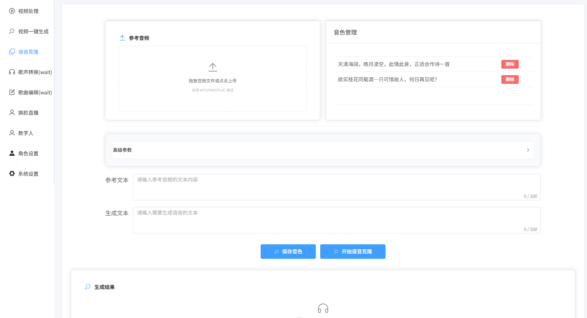

# listen-puzzle

### 介绍

ai项目工作流化尝试，并提供优雅的ui界面，方便创作

### 已集成

1. 视频一键下载（支持上千个平台）
2. 音视频简单处理
3. 字幕生成，翻译，合成
4. 语音克隆
5. 根据文案生成短视频

### 未来

1. 样式优化
2. 生成短视频工作流优化
3. 歌声转换（已实现未集成）
4. 支持多人声音字幕生成
5. 人脸克隆（已实现未集成）
6. 数字人生成（已实现未集成）
7. 大模型角色定义（开发中  --长期记忆 --角色身份认同）
8. mcp集成
### 引用下面项目部分代码

### 安装教程

1. 下载源码
2. requirements.txt依赖安装
3. windows上下载ffmpeg后，将bin目录下的 ffmpeg.exe和ffprobe.exe 文件复制到当前目录下的 ffmpeg 文件夹内
   下载地址：https://github.com/BtbN/FFmpeg-Builds/releases/download/autobuild-2023-11-30-12-55/ffmpeg-n6.0.1-win64-gpl-6.0.zip

#### 启动

api：

```
python run_api.py
```

webui：

```
python run_web.py
```
### 界面展示
